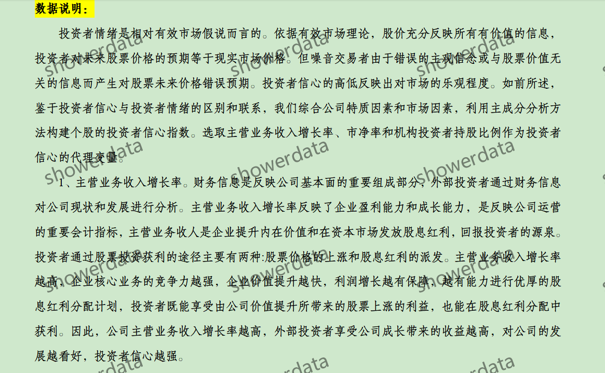
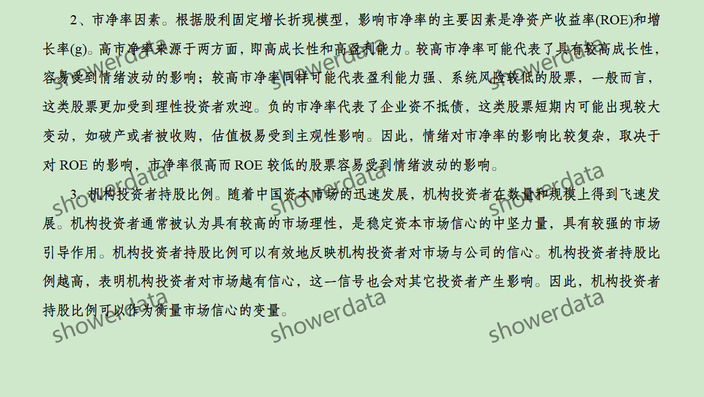
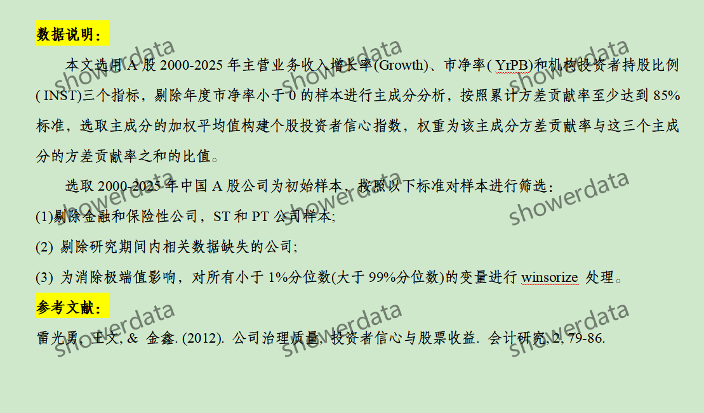
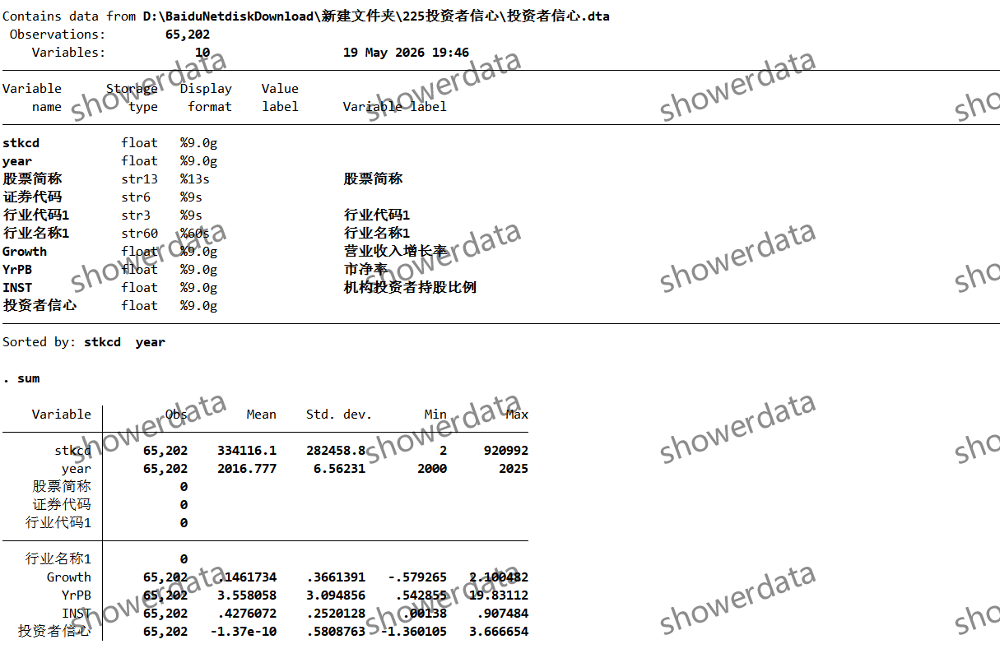
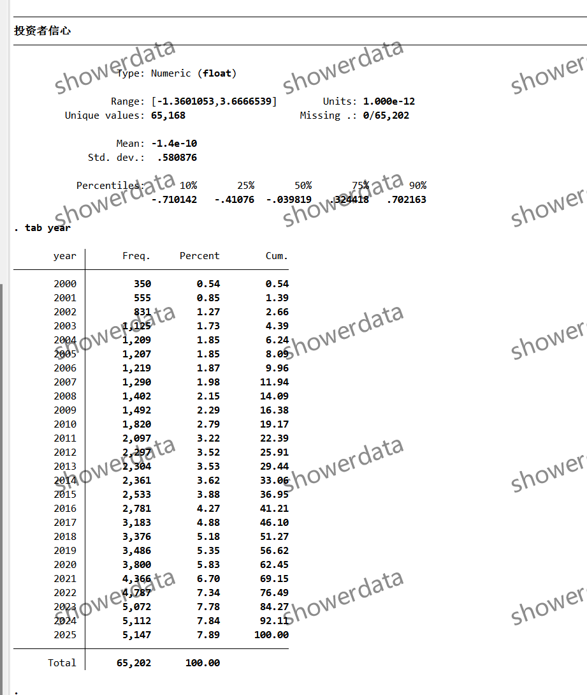
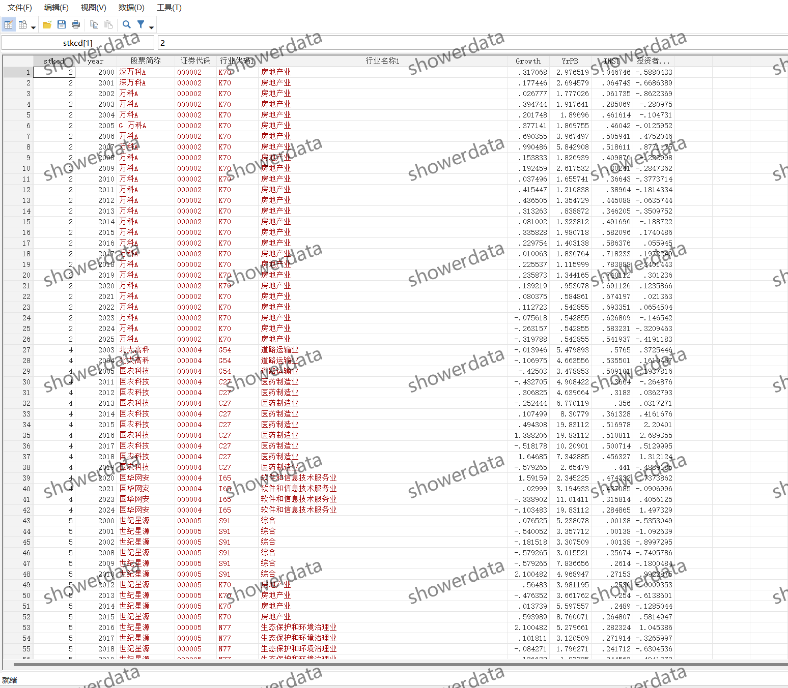
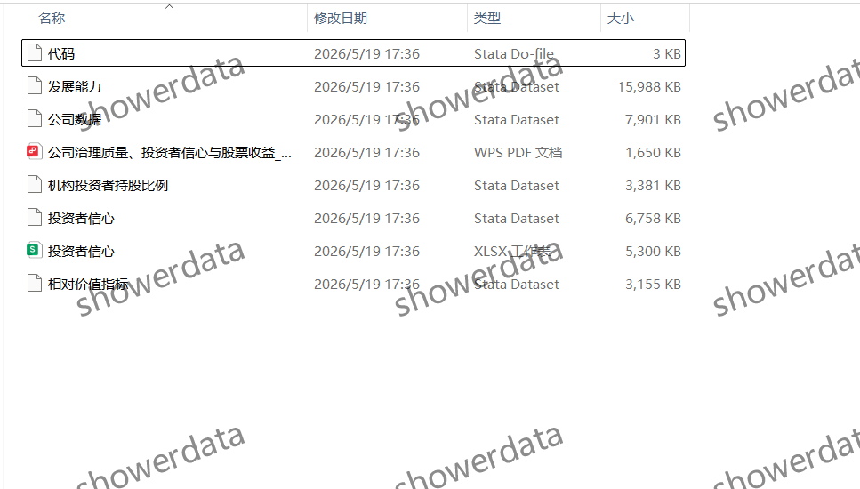

## Body

（2000-2025年）上市公司-投资者信心指数

After purchase, there is no reason to return without a justification. There may be missing values, please read carefully before purchasing or ask clearly before buying! The descriptive statistics shown are after removing outliers.

I. Data Introduction
(1) Details of the data: See the image below for details. Please read carefully before purchasing! The displayed explanation is provided, please confirm whether it is what you need before purchasing! No returns or exchanges will be accepted for any reason after shipment. Please confirm that you will use it before purchasing, and do not provide答疑, thank you! There may be missing values due to objective reasons, if you are not willing, please do not purchase, thank you!
(2) Name of the data: Stock List - Investor Sentiment Index
(3) Sample range: A company on the board
(4) Time range: 2000-2025
(5) Data format: Excel, DTA
(6) Data content: Results, references, codes, references

II. Data Result Indicators as shown in the figure

III. Method of indicator construction as shown in the figure

IV. References as shown in the figure

## Images

Here is a pay link on Stripe ( https://buy.stripe.com/3cs8yP7sY87d0vu9AB ). Please contact me lonlonago@foxmail.com after funding $89, and I will send you a complete data files , thank you!

